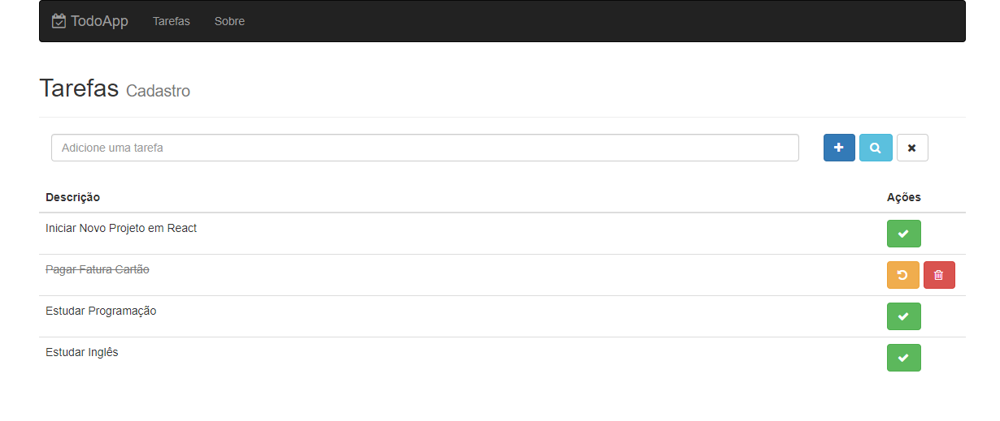

<h1 align="center">
  To-Do
</h1>

to-do-list

  

 

## 📅 Sobre

Aplicação desenvolvida com o conteúdo apresentado no curso de React da [cod3r.com.br](https://www.cod3r.com.br/)

## 🌐 Tecnologias Usadas
Foram usadas essas tecnologias:

- [React](https://pt-br.reactjs.org/)
 -
- axios
- bootstrap
- font-awesome
- react-router
- webpack

*Foram usados outros Frameworks no projeto, mas esses são os principais.*

## ***</>*** Como usar o código?
1. Instale o **Npm** em seu computador
1. Instale o **NodeJs** na versão >= 12.0
1. Clone este repositório `git clone https://github.com/JhonatanBergmann/todo-app.git`

### 🗃 Data
1. Acesse o Prompt de Comando e dê o comando `mongdodb` ou execute em MongoDB\Server\4.4\bin\mongod.exe

### ⚙️ Backend
1. Acesse a pasta *backend* e dê o comando `npm install`
1. Acesse novamente a pasta *backend* e dê o comando `npm run production`
 *Para acessar o Monit do PM2 basta rodar o comando `.\node_modules\.bin\pm2 monit`

### 🌐 Web
1. Acesse o diretório e dê o comando `npm install`
1. Acesse a pasta *web* e dê o comando `npm run dev`
1. Acesse em seu navegador a seguinte url `http://localhost:9090`

## 📝 Licença

Esse projeto está sob a licença MIT. Veja o arquivo [LICENSE](LICENSE) para mais detalhes.
